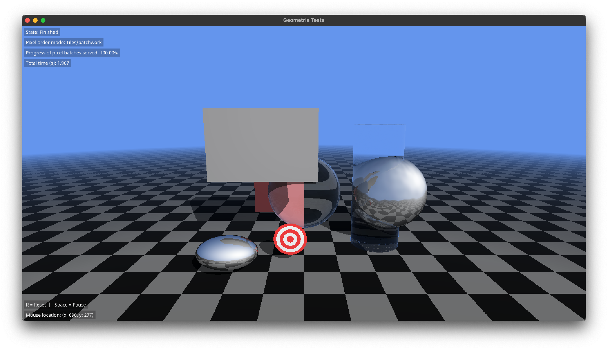

# GeometriaApp

A sample Raytracer implementation using [Geometria] as a backing geometry library.

### Running:

From terminal, run:

```bash
$ make run-rel
```

or on Windows (w/ Python 3.10 or greater):

```cmd
> python utils\build.py run -c release -t GeometriaApp -m Sources\GeometriaWindows\GeometriaApp.exe.manifest -cross-module-optimization
```

or:

```bash
$ swift run
```

And wait for the project to build and a window to pop up!

You should see something along the lines of:



[Geometria]: https://github.com/LuizZak/Geometria

Windows portion of this project where derived in part from https://github.com/compnerd/swift-win32
